# Tes Backend Developer - PT Aksamedia Mulia Digital

Repositori ini berisi kode sumber untuk tes masuk magang Backend Developer di PT Aksamedia Mulia Digital. Tes ini bertujuan untuk mengevaluasi pemahaman dan kemampuan kandidat dalam membuat API, memahami SQL, dan menyelesaikan masalah menggunakan logika pemrograman.

## Persyaratan

-   Laravel (versi terbaru)
-   MySQL / MariaDB
-   PHPMyAdmin / Adminer / HeidiSQL (atau database client lainnya)
-   Postman (atau API client lainnya)
-   PHP >= 8.1
-   Composer

## Instalasi

1. **Clone Repositori**

    ```bash
    git clone <repository-url>
    cd tes-be-aksamedia
    ```
2. **Install Dependencies**

    ```bash
    composer install
    ```
3. **Konfigurasi Environment**
    -   Salin file `.env.example` menjadi `.env`
    -   Sesuaikan konfigurasi database pada file `.env`
    -   Generate application key:

    ```bash
    php artisan key:generate
    ```
4. **Migrasi Database dan Seeding**

    ```bash
    php artisan migrate --seed
    ```
5. **Jalankan Server**

    ```bash
    php artisan serve
    ```
    Aplikasi akan berjalan di `http://localhost:8000`

## Tugas

Berikut adalah daftar tugas yang harus diselesaikan:

### Tugas 1: API Login

-   **Endpoint:** `/api/login`
-   **Method:** `POST`
-   **Deskripsi:** Membuat API untuk autentikasi pengguna.
-   **Kriteria:**
    -   Endpoint hanya dapat diakses tanpa autentikasi.
    -   Jika sudah login, request ditolak.
-   **Request (JSON):**

    ```json
    {
        "username": "admin",
        "password": "pastibisa"
    }
    ```

-   **Response (JSON):**

    ```json
    {
        "status": "success",
        "message": "Login successful",
        "data": {
            "token": "token_autentikasi",
            "admin": {
                "id": "uuid_admin",
                "name": "nama_admin",
                "username": "username_admin",
                "phone": "no_telepon_admin",
                "email": "email_admin"
            }
        }
    }
    ```

    Atau

    ```json
    {
        "status": "error",
        "message": "Invalid login details"
    }
    ```

-   **Screenshot Postman:**

    Sukses :

    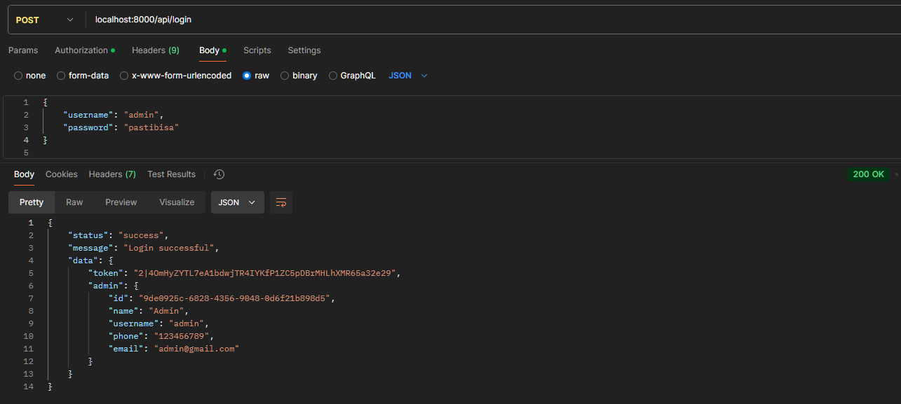

    Gagal :

    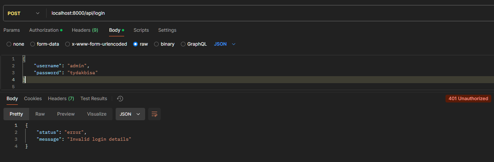

### Tugas 2: API Get All Data Divisi

-   **Endpoint:** `/api/divisions`
-   **Method:** `GET`
-   **Deskripsi:** Membuat API untuk mengambil semua data divisi.
-   **Kriteria:**
    -   Endpoint hanya dapat diakses dengan autentikasi.
    -   Mendukung filter berdasarkan nama divisi (query parameter `name`).
    -   Data dummy sudah disediakan melalui seeder (`Mobile Apps, QA, Full Stack, Backend, Frontend, UI/UX Designer`).
-   **Request (JSON):**

    ```json
    {
        "name": "Frontend"
    }
    ```

-   **Response (JSON):**

    ```json
    {
        "status": "success",
        "message": "Divisions retrieved successfully",
        "data": {
            "divisions": [
                {
                    "id": "uuid_divisi",
                    "name": "nama_divisi"
                },
                {
                    "id": "uuid_divisi",
                    "name": "nama_divisi"
                }
            ]
        },
        "pagination": {
            "total": 6,
            "per_page": 10,
            "current_page": 1,
            "last_page": 1,
            "from": 1,
            "to": 6
        }
    }
    ```

-   **Screenshot Postman:**

    Sukses :

    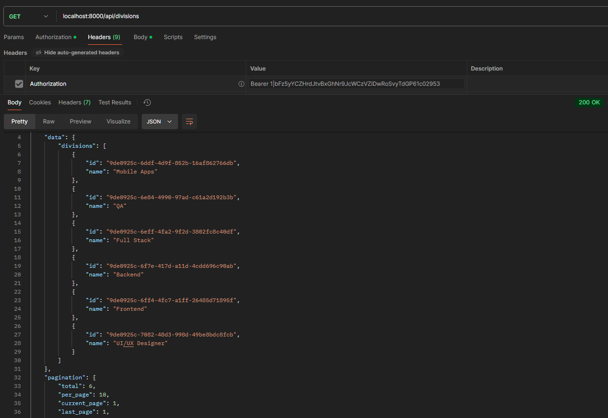

    Sukses filter by name :

    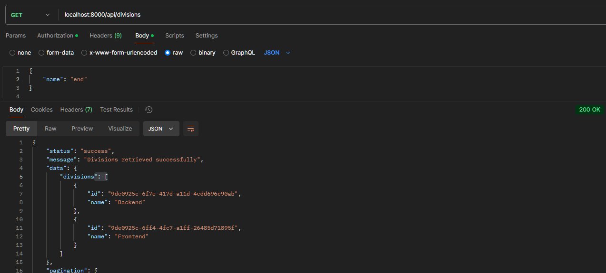

### Tugas 3: API Get All Data Karyawan

-   **Endpoint:** `/api/employees`
-   **Method:** `GET`
-   **Deskripsi:** Membuat API untuk mengambil semua data karyawan.
-   **Kriteria:**
    -   Endpoint hanya dapat diakses dengan autentikasi.
    -   Mendukung filter berdasarkan nama karyawan (query parameter `name`).
    -   Mendukung filter berdasarkan ID divisi (query parameter `division_id`).
-   **Request (JSON):**

    ```json
    {
        "name": "Nama Pegawai Dua",
        "division_id": "uuid_divisi"
    }
    ```

-   **Response (JSON):**

    ```json
    {
        "status": "success",
        "message": "Employees retrieved successfully",
        "data": {
            "employees": [
                {
                    "id": "uuid_pegawai",
                    "image": "url_foto_pegawai",
                    "name": "nama_pegawai",
                    "phone": "no_telepon_pegawai",
                    "division": {
                        "id": "uuid_divisi",
                        "name": "nama_divisi"
                    },
                    "position": "jabatan_pegawai"
                },
                {
                    "id": "uuid_pegawai",
                    "image": "url_foto_pegawai",
                    "name": "nama_pegawai",
                    "phone": "no_telepon_pegawai",
                    "division": {
                        "id": "uuid_divisi",
                        "name": "nama_divisi"
                    },
                    "position": "jabatan_pegawai"
                }
            ]
        },
        "pagination": {
            "total": 33,
            "per_page": 7,
            "current_page": 1,
            "last_page": 5,
            "from": 1,
            "to": 7
        }
    }
    ```

-   **Screenshot Postman:**

    Sukses :

    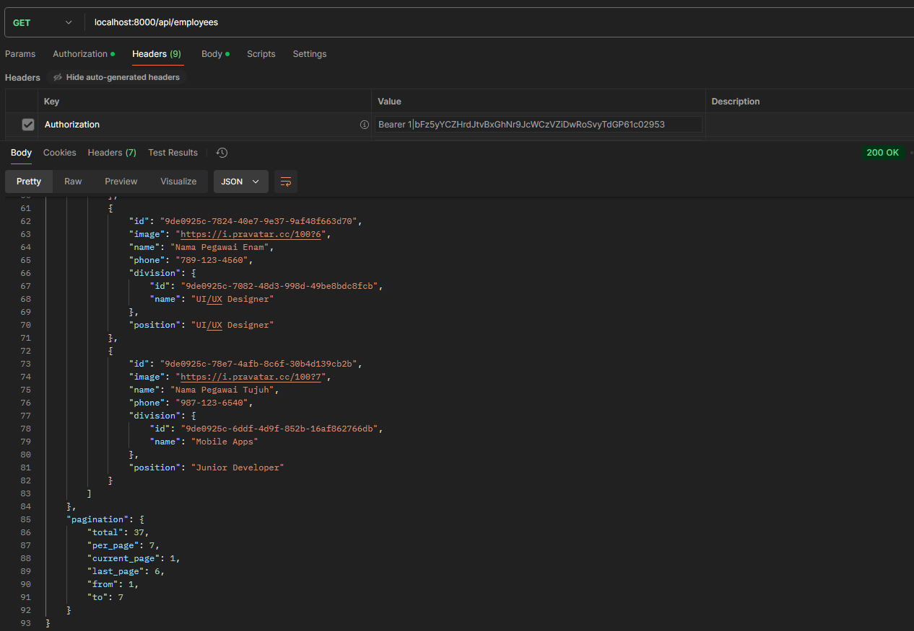

    Sukses Filter Name "Lima" :

    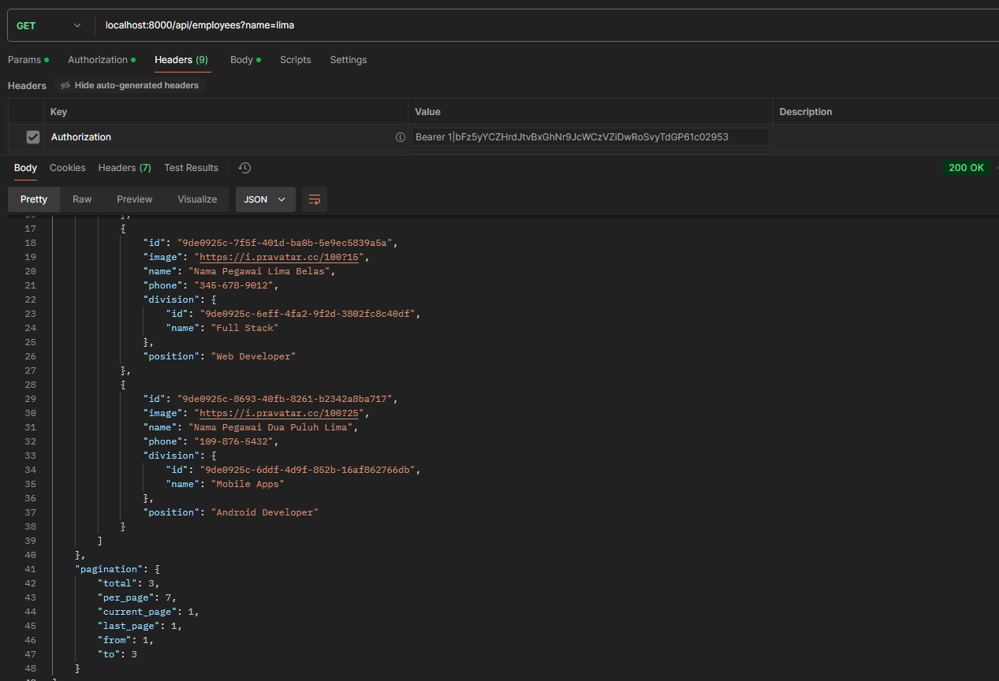

    Sukses Filter Division :

    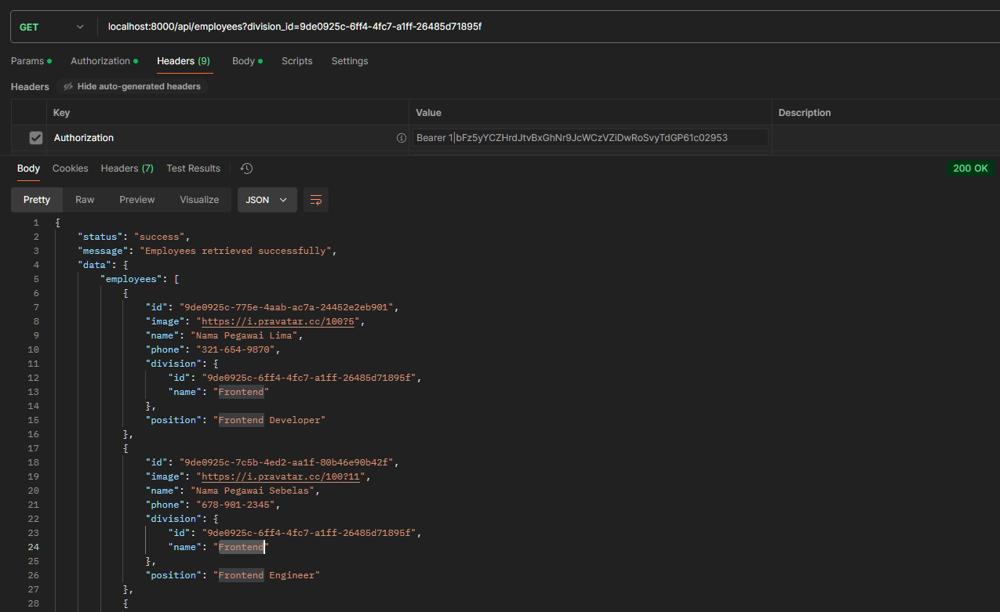

### Tugas 4: API Create Data Karyawan

-   **Endpoint:** `/api/employees`
-   **Method:** `POST`
-   **Deskripsi:** Membuat API untuk menambahkan data karyawan baru.
-   **Kriteria:**
    -   Endpoint hanya dapat diakses dengan autentikasi.
-   **Request (JSON):**

    ```json
    {
        "image": "file_foto_pegawai",
        "name": "nama_pegawai",
        "phone": "no_telepon_pegawai",
        "division_id": "uuid_divisi",
        "position": "jabatan_pegawai"
    }
    ```

-   **Response (JSON):**

    ```json
    {
        "status": "success",
        "message": "Employee created successfully"
    }
    ```

    atau

    ```json
    {
        "status": "error",
        "message": "Validation error",
        "errors": {
            "name": [
            "The name field is required."
            ],
            "phone": [
            "The phone field is required."
            ],
            "position": [
            "The position field is required."
            ],
            "division_id": [
            "The division id field is required."
            ]
        }
    }
    ```

-   **Screenshot Postman:**

    Sukses :

    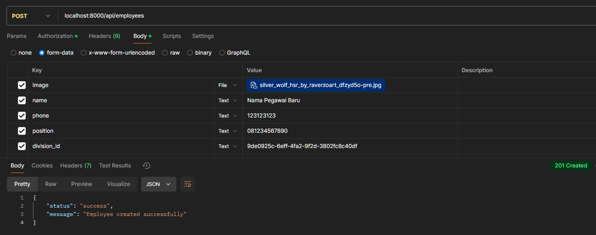

    Gagal Validasi :

    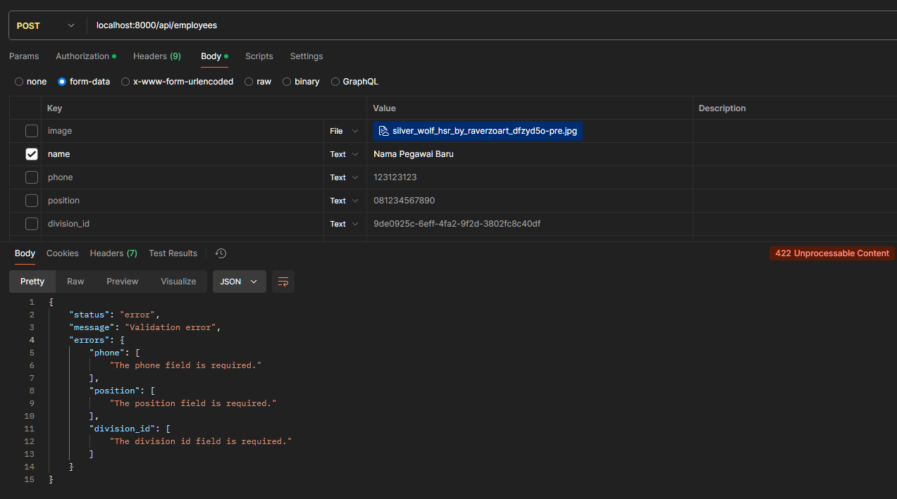

### Tugas 5: API Update Data Karyawan

-   **Endpoint:** `/api/employees/{employee}`
-   **Method:** `PUT`
-   **Deskripsi:** Membuat API untuk memperbarui data karyawan.
-   **Kriteria:**
    -   Endpoint hanya dapat diakses dengan autentikasi.
    -   `{employee}` pada endpoint merupakan `uuid` dari data karyawan yang ingin diupdate
-   **Request (JSON):**

    ```json
    {
        "image": "file_foto_pegawai",
        "name": "nama_pegawai_baru",
        "phone": "no_telepon_pegawai_baru",
        "division_id": "uuid_divisi_baru",
        "position": "jabatan_pegawai_baru"
    }
    ```

-   **Response (JSON):**

    ```json
    {
        "status": "success",
        "message": "Employee updated successfully"
    }
    ```

    atau

    ```json
    {
        "status": "error",
        "message": "Validation error",
        "errors": {
            "name": [
            "The name field is required."
            ],
            "phone": [
            "The phone field is required."
            ],
            "position": [
            "The position field is required."
            ],
            "division_id": [
            "The division id field is required."
            ]
        }
    }
    ```

-   **Screenshot Postman:**

    Sukses :

    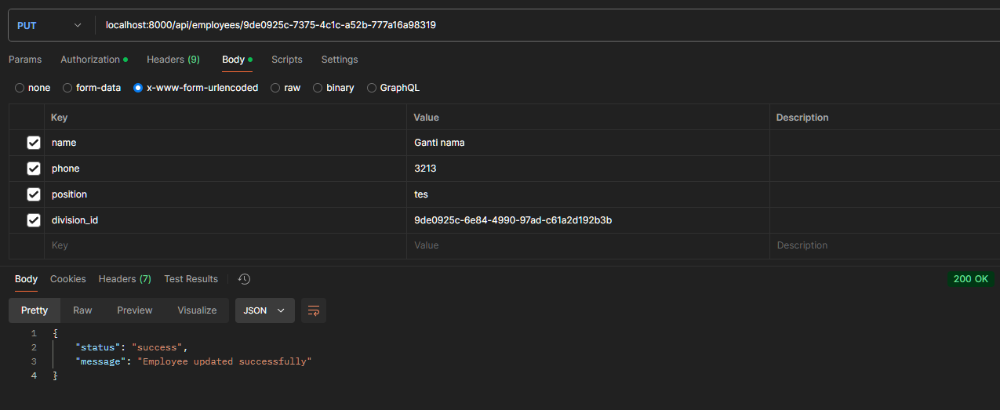

    Gagal Validasi :

    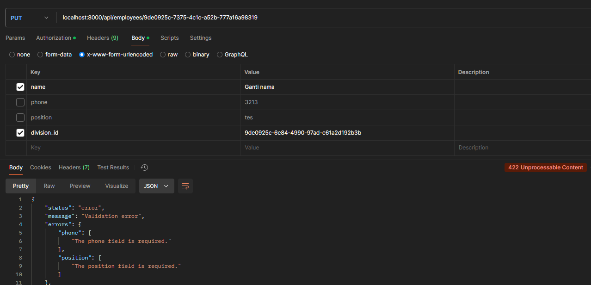

### Tugas 6: API Delete Data Karyawan

-   **Endpoint:** `/api/employees/{employee}`
-   **Method:** `DELETE`
-   **Deskripsi:** Membuat API untuk menghapus data karyawan.
-   **Kriteria:**
    -   Endpoint hanya dapat diakses dengan autentikasi.
    -   `{employee}` pada endpoint merupakan `uuid` dari data karyawan yang ingin dihapus
-   **Response (JSON):**

    ```json
    {
        "status": "success",
        "message": "Employee deleted successfully"
    }
    ```

    atau

    ```json
    {
        "status": "error",
        "message": "Employee not found"
    }
    ```

-   **Screenshot Postman:**

    Sukses :

    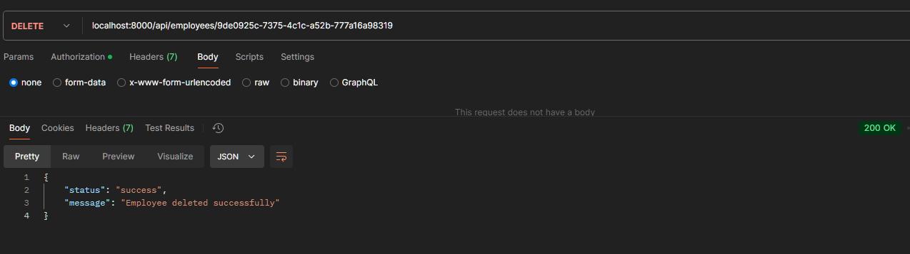

    Gagal setelah dihapus :

    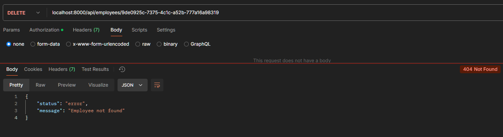

### Tugas 7: API Logout

-   **Endpoint:** `/api/logout`
-   **Method:** `POST`
-   **Deskripsi:** Membuat API untuk logout.
-   **Kriteria:**
    -   Endpoint hanya dapat diakses dengan autentikasi.
-   **Response (JSON):**

    ```json
    {
        "status": "success",
        "message": "Logged out successfully"
    }
    ```

-   **Screenshot Postman:**

    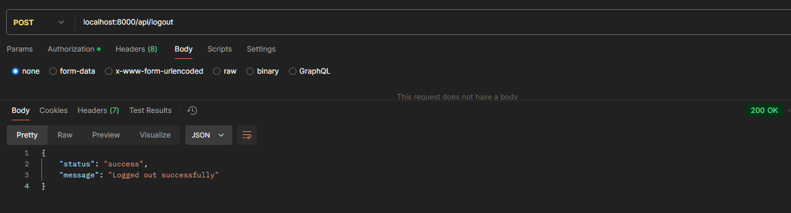